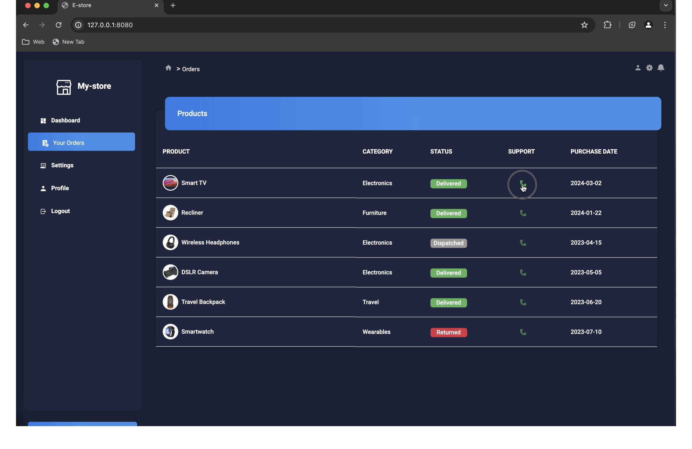
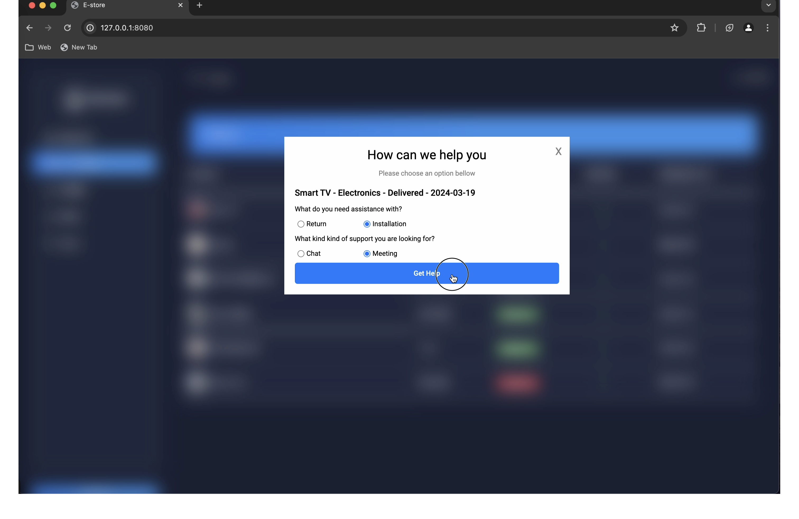
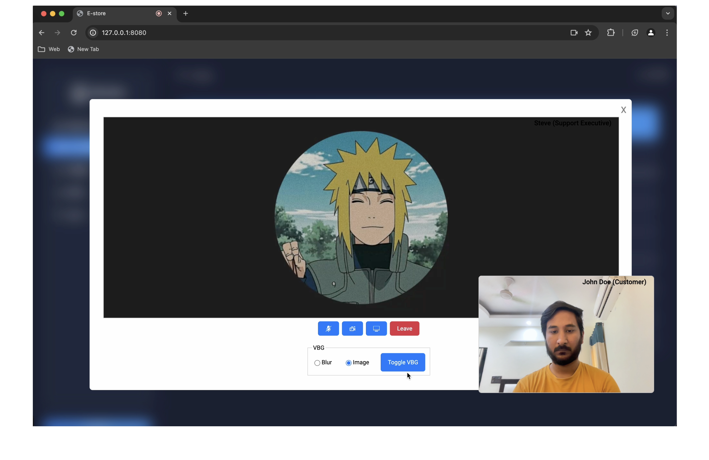
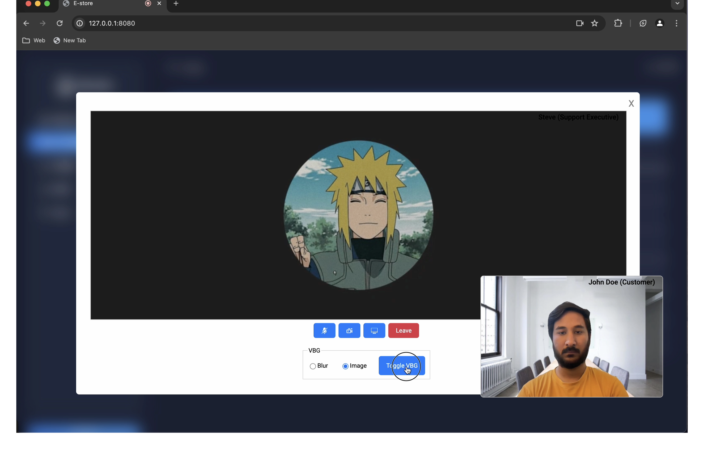

# Webex Web SDK - Meetings Webinar Demo

To run this demo,

- Clone this Repo
- Open [meeting-info.js](./meeting-info.js), read through the comments and update required information.
- Once done, do `yarn start`

- Go to http://127.0.0.1:8080/ on your browser and Clicking on the "Call" icon will make the demo join the created meeting with Video and Audio
  

- Complete the short form and click on "Get Help" 
- User will be connect to the customer support 
- To enable virtual background click on "Toggle VBG" 

## Vidcast to the Webinar of this Demo

To get a better hold of this demo, please watch the full length Webinar here: [Upgrade Your App with Webex Meetings SDK V3 Simplified Integration and Enhanced Features](https://app.vidcast.io/share/bcd28aa8-ab52-46bc-8ca8-3c2aa41f8f83)

## Contact Us

### Contributors Space

Webex SDK Contributors - https://eurl.io/#v-LbYXL27

### Developer Support

- [Developer Support](https://developer.webex.com/support)
- [Developer Community](https://community.cisco.com/t5/webex-for-developers/bd-p/disc-webex-developers)
- [GitHub Repository Issues](https://github.com/webex/webex-js-sdk/issues) - (Issues, Q & A, Features)
- Email - devsupport@webex.com

### Webex Developers Beta Program

- [Go Beta - Webex Developers](https://gobeta.webex.com/key/dev-platform)

### Feature Requests

- Cisco Collab Aha - https://ciscocollaboration.ideas.aha.io/

## Documentation

### SDK Usage

- [Github Wiki](https://github.com/webex/webex-js-sdk/wiki)
- [Meetings Developer REST APIs](https://developer.webex.com/docs/meetings)

### Service Aapps Guest

- [Service Apps](https://developer.webex.com/docs/sa-guest-management)
- [API Blueprint for Guest Creation](https://developer.webex.com/docs/api/v1/guests-management/create-a-guest)

### Streams & Effects

- [Streams & Stream Creation](https://github.com/webex/webex-js-sdk/wiki/Streams-and-Effects#streams)
- [Virtual Background Effect](https://github.com/webex/webex-js-sdk/wiki/Streams-and-Effects#virtual-background-effect)
- [Background Noise Reduction Effect](https://github.com/webex/webex-js-sdk/wiki/Streams-and-Effects#apply-the-noise-reduction-effect)

### Transcription with Voicea

- [Advanced Meeting Controls - Transcription](https://github.com/webex/webex-js-sdk/wiki/Advanced-Meeting-Controls#transcription)

### Migration

- [Web SDK V2 to V3 Migration](https://github.com/webex/webex-js-sdk/wiki/Migrating-SDK-Version-1-or-Version-2-to-Version-3)
- [Migration to improved meetings associated with a space](https://github.com/webex/webex-js-sdk/wiki/Migration-to-improved-meetings-associated-with-a-space)
